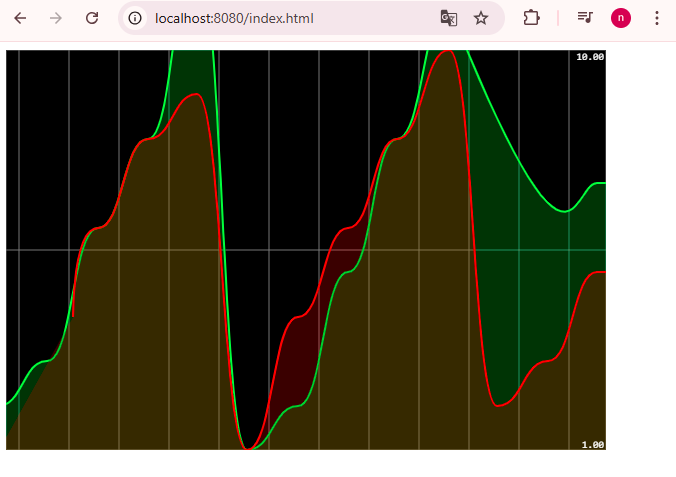

# Activité Pratique N°1 - Event Driven Architecture avec KAFKA
## Overview
This project demonstrates the integration of Apache Kafka with Docker and Spring Cloud Stream to build a **real-time analytics system**.
It includes producing and consuming Kafka events, stream processing with Kafka Streams, and a simple web interface to visualize analytics in real time.
## 1. Kafka without Docker
### 1. Download Apache Kafka: Kafka Downloads
### 2. Unzip the downloaded package.
### 3. Start Zookeeper:
```bash
bin/zookeeper-server-start.sh config/zookeeper.properties
```
### 4. Start Kafka broker:
```bash
bin/kafka-server-start.sh config/server.properties
```
### 5. Test with console producer and consumer:
```bash
bin/kafka-console-producer.sh --broker-list localhost:9092 --topic test
bin/kafka-console-consumer.sh --bootstrap-server localhost:9092 --topic test --from-beginning
```
## 2. Kafka with Docker
### 1. Create a docker-compose.yml file:
```yaml
version: '3'
services:
zookeeper:
image: confluentinc/cp-zookeeper:7.3.0
container_name: bdcc-zookeeper
environment:
ZOOKEEPER_CLIENT_PORT: 2181
ZOOKEEPER_TICK_TIME: 2000


broker:
image: confluentinc/cp-kafka:7.3.0
container_name: bdcc-kafka-broker
ports:
- "9092:9092"
depends_on:
- zookeeper
environment:
KAFKA_BROKER_ID: 1
KAFKA_ZOOKEEPER_CONNECT: 'zookeeper:2181'
KAFKA_LISTENER_SECURITY_PROTOCOL_MAP: PLAINTEXT:PLAINTEXT,PLAINTEXT_INTERNAL:PLAINTEXT
KAFKA_ADVERTISED_LISTENERS: PLAINTEXT://localhost:9092,PLAINTEXT_INTERNAL://broker:29092
KAFKA_OFFSETS_TOPIC_REPLICATION_FACTOR: 1
KAFKA_TRANSACTION_STATE_LOG_MIN_ISR: 1
KAFKA_TRANSACTION_STATE_LOG_REPLICATION_FACTOR: 1
```
###  2. Start containers:
```bash
docker-compose up -d
```
### 3. Check running containers:
```bash
docker ps
```
### 4. Create a topic:
```bash
docker exec -it bdcc-kafka-broker kafka-topics --create --topic T2 --bootstrap-server broker:29092 --partitions 1 --replication-factor 1
```
## Project Structure and Classes


### PageEvent
A simple record class to represent a page event.
```java
public record PageEvent(String name, String user, Date date, long duration) {
}
```
### PageEventController
#### Handles publishing and analytics streaming:
```java

@RestController
public class PageEventController {
    @Autowired
    private StreamBridge streamBridge;
    @Autowired
    private InteractiveQueryService interactiveQueryService;
    @GetMapping("/publish")
    public PageEvent publish(String name, String topic){
        PageEvent event= new PageEvent(
                name,
                Math.random()>0.5?"U1":"U2",
                new Date(),10+new Random().nextInt(10000));
        streamBridge.send(topic, event);
        return event;
    }

    @GetMapping(path = "/analytics",produces = MediaType.TEXT_EVENT_STREAM_VALUE)
    public Flux<Map<String, Long>> analytics(){
        return Flux.interval(Duration.ofSeconds(1))
                .map(sequence->{
                    Map<String,Long> stringLongMap=new HashMap<>();
                    ReadOnlyWindowStore<String, Long> windowStore = interactiveQueryService.getQueryableStore("count-store", QueryableStoreTypes.windowStore());
                    Instant now=Instant.now();
                    Instant from=now.minusMillis(5000);
                    KeyValueIterator<Windowed<String>, Long> fetchAll = windowStore.fetchAll(from, now);
                    //WindowStoreIterator<Long> fetchAll = windowStore.fetch(page, from, now);
                    while (fetchAll.hasNext()){
                        KeyValue<Windowed<String>, Long> next = fetchAll.next();
                        stringLongMap.put(next.key.key(),next.value);
                    }
                    return stringLongMap;
                });
    }

}

```
### PageEventHandler
Defines beans for consumer, supplier, and stream function:
```java

@Component
public class PageEventHandler {
    @Bean
    public Consumer<Message<PageEvent>> pageEventConsumer(){
        return (input)->{
            System.out.println("*******************");
            System.out.println(input.getPayload());
            System.out.println("*****************");
        };
    }
    @Bean
    public Supplier<PageEvent> pageEventSupplier(){
        return ()->{
            return new PageEvent(
                    Math.random()>0.5?"P1":"P2",
                    Math.random()>0.5?"U1":"U2",
                    new Date(),
                    10+new Random().nextInt(10000)
            );
        };
    }
    @Bean
    public Function<KStream<String, PageEvent>, KStream<String, Long>> kStreamFunction(){
        return (input)->
                input
                        .filter((k,v)->v.duration()>100)
                        .map((k,v)->new KeyValue<>(v.name(), v.duration()))
                        .groupByKey(Grouped.with(Serdes.String(), Serdes.Long()))
                        .windowedBy(TimeWindows.of(Duration.ofSeconds(5)))
                        .count(Materialized.as("count-store"))
                        .toStream()

                        .map((k,v)->new KeyValue<>(k.key(), v))
                ;
    }


}
```
### analytics UI

